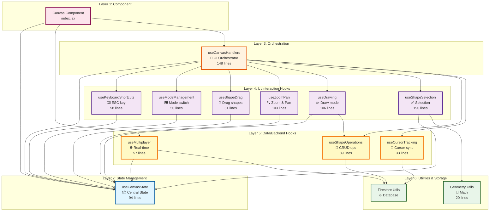
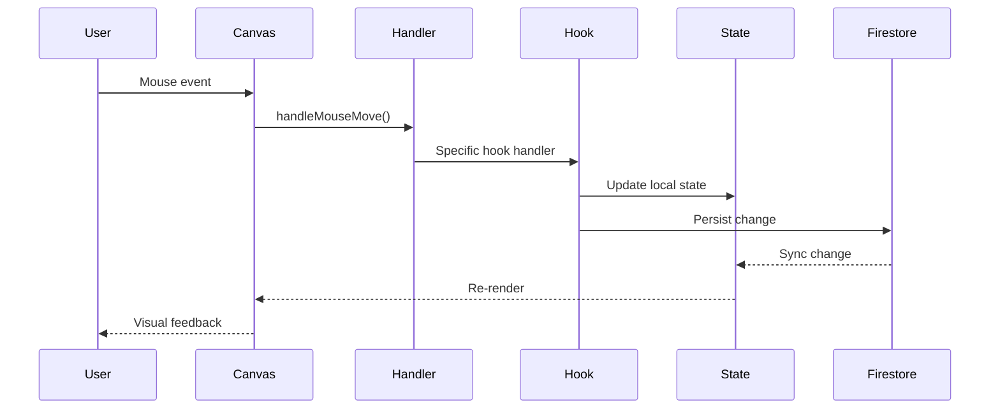
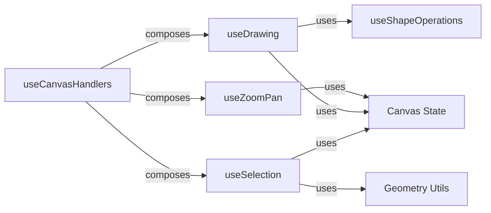

# Canvas Hooks Architecture

## Overview
This document shows how all the custom hooks in the Canvas component are organized and how they interact with each other.

### Architecture Layers

The architecture is organized in **6 distinct layers**, from top to bottom:

1. **Component Layer** - The main Canvas React component
2. **State Management Layer** - Central state container (useCanvasState)
3. **Orchestration Layer** - UI event orchestrator (useCanvasHandlers)
4. **UI/Interaction Hooks Layer** - Local UI logic (no direct Firestore access)
5. **Data/Backend Hooks Layer** - Firestore communication and sync
6. **Utilities & Storage Layer** - Helper functions and database

**Key Distinction:** Layers 4 and 5 are separate because:
- **Layer 4 (UI Hooks)**: Handle user interactions locally, update state
- **Layer 5 (Data Hooks)**: Communicate with backend (Firestore), sync data

---

## Architecture Diagram



---

## Hook Relationships Details

### 1. **useCanvasState** (Central State)
**Purpose:** Manages all canvas state  
**Used by:** All other hooks  
**Dependencies:** None  
**Exports:** 22 state variables and setters

```javascript
// States managed:
- Canvas transform (scale, position)
- Shapes data
- UI modes (select, add, delete, pan)
- Drawing state (isDrawing, preview)
- Selection state (selectedShapes, marquee)
- Multiplayer state (cursors, onlineUsers)
```

---

### 2. **useCanvasHandlers** (UI Orchestrator)
**Purpose:** Composes all UI and data hooks into unified interface  
**Used by:** Canvas component  
**Dependencies:** ALL feature hooks (UI + Data layers)  
**Pattern:** Composition pattern

```javascript
// Orchestrates UI Hooks (Layer 4):
✅ useKeyboardShortcuts(canvasState)
✅ useModeManagement(canvasState)
✅ useShapeDrag(canvasState)
✅ useZoomPan(canvasState)
✅ useDrawing(canvasState, createShapeAt)
✅ useShapeSelection(canvasState)

// Orchestrates Data Hooks (Layer 5):
✅ useShapeOperations(currentUser, selectedColor)
✅ useCursorTracking(currentUser)
```

---

### 3. **useKeyboardShortcuts** (Keyboard)
**Purpose:** Handle keyboard events (ESC)  
**Dependencies:** canvasState  
**Side effects:** Exits modes, deselects shapes

```
ESC key → Exits current mode + Deselects shapes
```

---

### 4. **useModeManagement** (Mode Switching)
**Purpose:** Toggle between modes (Add, Delete, Select, Pan)  
**Dependencies:** canvasState  
**Ensures:** Only one mode active at a time

```
toggleAddMode() → Deactivates Delete mode
toggleDeleteMode() → Deactivates Add mode
```

---

### 5. **useShapeDrag** (Shape Dragging)
**Purpose:** Handle shape drag start/end  
**Dependencies:** canvasState  
**Manages:** `isDraggingShape` flag

```
Drag start → isDraggingShape = true
Drag end → isDraggingShape = false
```

---

### 6. **useZoomPan** (Canvas Navigation)
**Purpose:** Handle zoom (mouse wheel/trackpad) and pan (drag)  
**Dependencies:** canvasState  
**Features:** 
- Auto-detect mouse vs trackpad
- Zoom centered on cursor
- Pan only in valid modes

```
Mouse wheel → Zoom in/out
Drag canvas → Pan (move viewport)
```

---

### 7. **useShapeOperations** (CRUD)
**Purpose:** Create, delete shapes in Firestore  
**Dependencies:** currentUser, selectedColor, Firestore  
**Operations:**
- Create single shape
- Delete all shapes
- Batch create (stress test)

```
createShapeAt(x, y) → Firestore
deleteAllShapes() → Firestore
add500Rectangles() → Firestore (batch)
```

---

### 8. **useDrawing** (Draw Mode)
**Purpose:** Handle rectangle drawing in Add mode  
**Dependencies:** canvasState, createShapeAt (from useShapeOperations)  
**Flow:**

```
Mouse down → Start drawing + Show preview
Mouse move → Update preview
Mouse up → Create shape + Exit mode
```

---

### 9. **useShapeSelection** (Marquee Selection)
**Purpose:** Handle shape selection with marquee (drag to select)  
**Dependencies:** canvasState, rectanglesIntersect (geometry)  
**Features:**
- Single click selection
- Marquee drag selection
- Multi-select with Shift/Cmd/Ctrl
- Real-time preview

```
Click shape → Select single
Drag marquee → Select multiple
Shift + Drag → Add to selection
Click empty → Deselect all
```

---

### 10. **useCursorTracking** (Multiplayer Cursor)
**Purpose:** Track and broadcast cursor position  
**Dependencies:** currentUser, Firestore  
**Throttling:** Updates every 16ms (60fps)

```
Mouse move → Throttle → Firestore → Other users see cursor
```

---

### 11. **useMultiplayer** (Real-time Sync)
**Purpose:** Subscribe to Firestore changes  
**Dependencies:** Firestore, canvasState  
**Subscriptions:**
- Shapes changes
- Cursors changes
- User presence

```
Firestore changes → Local state updates → UI re-renders
```

---

## Data Flow

### User Interaction Flow


### Hook Composition Pattern


---

## Hook Dependencies Matrix

| Hook | Layer | Depends On | Used By | Accesses Firestore |
|------|-------|-----------|---------|-------------------|
| `useCanvasState` | 2 | - | All hooks | ❌ |
| `useCanvasHandlers` | 3 | All feature hooks | Canvas component | ❌ |
| **UI Hooks (Layer 4)** |
| `useKeyboardShortcuts` | 4 | canvasState | useCanvasHandlers | ❌ |
| `useModeManagement` | 4 | canvasState | useCanvasHandlers | ❌ |
| `useShapeDrag` | 4 | canvasState | useCanvasHandlers | ❌ |
| `useZoomPan` | 4 | canvasState | useCanvasHandlers | ❌ |
| `useDrawing` | 4 | canvasState, useShapeOperations | useCanvasHandlers | ❌ |
| `useShapeSelection` | 4 | canvasState, geometry | useCanvasHandlers | ❌ |
| **Data Hooks (Layer 5)** |
| `useShapeOperations` | 5 | currentUser, Firestore | useCanvasHandlers, useDrawing | ✅ |
| `useCursorTracking` | 5 | currentUser, Firestore | useCanvasHandlers | ✅ |
| `useMultiplayer` | 5 | canvasState, Firestore | Canvas component | ✅ |

---

## Benefits of This Architecture

### 1. **Separation of Concerns**
Each hook has a single, well-defined responsibility

### 2. **Clear Layer Separation**
- **UI Hooks (Layer 4)**: Pure UI logic, no backend coupling
- **Data Hooks (Layer 5)**: Backend communication isolated
- Easy to mock Layer 5 for offline testing

### 3. **Testability**
- Hooks can be tested in isolation
- UI logic testable without Firestore
- Data hooks mockable for unit tests

### 4. **Reusability**
Hooks can be used in other components or projects

### 5. **Maintainability**
Easy to locate and modify specific features by layer

### 6. **Scalability**
New features can be added as new hooks in appropriate layer

### 7. **Performance**
Data hooks can be optimized independently (caching, batching)

---

## Adding a New Feature

To add a new tool/mode, follow this pattern:

1. **Create new hook** (e.g., `useCircleTool.js`)
2. **Import in useCanvasHandlers**
3. **Call in orchestrator**
4. **Compose handlers**

```javascript
// 1. Create hook
export const useCircleTool = (canvasState, createCircleAt) => {
  // Circle drawing logic
  return { handleCircleMouseDown, handleCircleMouseMove, ... }
}

// 2. In useCanvasHandlers
import { useCircleTool } from './useCircleTool'

const { handleCircleMouseDown, ... } = useCircleTool(canvasState, createCircleAt)

// 3. Compose in handleMouseDown
if (isCircleMode) handleCircleMouseDown(e, canvasPos)
```

---

## File Size Summary

| File | Lines | Purpose |
|------|-------|---------|
| `useCanvasState.js` | 94 | Central state |
| `useCanvasHandlers.js` | 148 | Orchestrator |
| `useKeyboardShortcuts.js` | 58 | Keyboard |
| `useModeManagement.js` | 50 | Modes |
| `useShapeDrag.js` | 31 | Drag shapes |
| `useZoomPan.js` | 103 | Navigation |
| `useShapeOperations.js` | 89 | CRUD |
| `useDrawing.js` | 106 | Draw mode |
| `useShapeSelection.js` | 190 | Selection |
| `useCursorTracking.js` | 33 | Multiplayer |
| `useMultiplayer.js` | 57 | Real-time |
| `geometry.js` | 20 | Math utils |
| **TOTAL** | **979** | **Complete system** |

**Original file:** 545 lines  
**New architecture:** 979 lines across 12 files  
**Difference:** +434 lines (+80% for better organization)

---

**Note:** The increase in total lines is a positive trade-off for:
- Better code organization
- Improved maintainability
- Enhanced testability
- Easier debugging
- Scalable architecture

